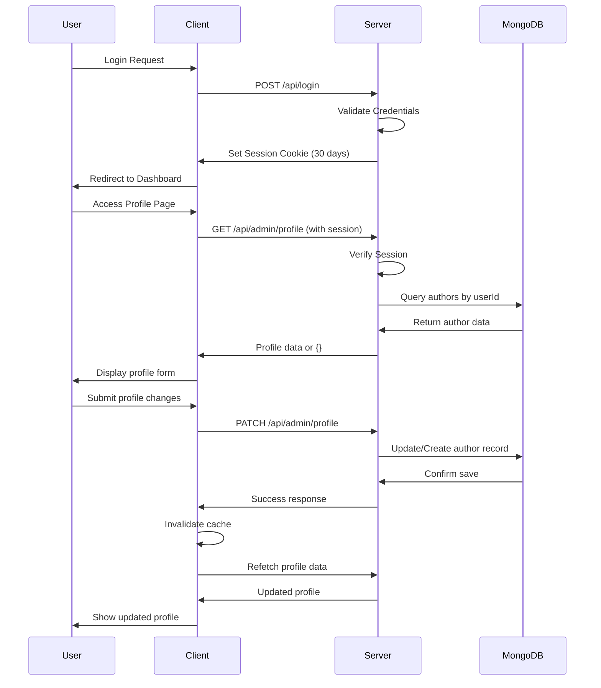

# AgroTech Blog Platform

A modern agrotech blog platform leveraging advanced content management technologies to create an engaging and interactive reader experience.

## Key Technologies

- **Frontend**: React.js with TypeScript
- **Backend**: Node.js with Express
- **Database**: MongoDB with Drizzle ORM
- **Styling**: Tailwind CSS with forest-green theme (#2D5016)
- **Authentication**: Session-based auth with 30-day persistence
- **Content Management**: Tag-based organization with AI-powered suggestions
- **AI Integration**: Perplexity API for intelligent content tagging

## Architecture Overview

### Profile Management System

The profile management system connects user authentication with author records for blog posts. Here's the complete data flow:

```mermaid
flowchart TD
    A[User Login] --> B[Session Created with User ID]
    B --> C[Admin Dashboard Access]
    C --> D[Profile Management Tab]
    
    D --> E[GET /api/admin/profile]
    E --> F[Check Authentication]
    F -->|Authenticated| G[Query Authors Collection by userId]
    F -->|Not Authenticated| H[Return 401 Unauthorized]
    
    G --> I{Author Record Exists?}
    I -->|Yes| J[Return Existing Profile Data]
    I -->|No| K[Return Empty Object {}]
    
    J --> L[Display Profile Form with Data]
    K --> M[Display Empty Profile Form]
    
    L --> N[User Edits Profile]
    M --> N
    N --> O[Submit Profile Changes]
    
    O --> P[PATCH /api/admin/profile]
    P --> Q[Validate Authentication]
    Q -->|Valid| R[Find Existing Author by userId]
    Q -->|Invalid| S[Return 401]
    
    R --> T{Author Exists?}
    T -->|Yes| U[Update Existing Author Record]
    T -->|No| V[Create New Author with userId Link]
    
    U --> W[Save to MongoDB Authors Collection]
    V --> W
    W --> X[Return Success Response]
    X --> Y[Invalidate React Query Cache]
    Y --> Z[Refetch Profile Data]
    Z --> AA[Display Updated Profile]
    
    subgraph MongoDB
        BB[(Authors Collection)]
        CC[(Blog Posts Collection)]
        DD[(Users Collection)]
    end
    
    W --> BB
    BB -.-> CC
    BB -.-> DD
```

### Data Persistence Issue Resolution

The profile management system was experiencing data loss after page refresh due to improper userId linking. The solution involved:

1. **Schema Update**: Added `userId` field to authors table
2. **Database Relationship**: Linked author records to user sessions via `userId`
3. **Query Optimization**: Modified `getAuthorByUserId()` to properly retrieve linked records
4. **Cache Management**: Implemented proper React Query cache invalidation

### Authentication Flow



## Content Organization

The platform uses a tag-based content system instead of traditional categories:

- **Tag-Based Navigation**: Posts organized by flexible tags
- **AI-Powered Suggestions**: Perplexity API generates relevant tags
- **Personalized Discovery**: Cookie-based content recommendations
- **Smart Filtering**: Users can explore content by clicking tag badges

## Design Principles

- **Golden Ratio Proportions**: All components use 1:1.618 ratios
- **Forest Green Theme**: Consistent #2D5016 color throughout
- **Performance Optimization**: Streamlined code to avoid complexity
- **Mobile Responsive**: Tailwind CSS responsive design patterns

## Development Guidelines

### Database Operations
- Use MongoDB storage with proper userId linking
- Maintain data relationships through foreign keys
- Implement proper error handling for all database operations

### Authentication
- Session-based auth with 30-day persistence
- Protect admin routes with proper middleware
- Link user sessions to content ownership

### Profile Management
- Author records must include userId for proper linking
- Profile changes persist through database updates
- React Query cache invalidation ensures immediate UI updates

## Environment Setup

Required environment variables:
- `DATABASE_URL`: MongoDB connection string
- `SESSION_SECRET`: Session encryption key
- `PERPLEXITY_API_KEY`: AI content analysis
- Authentication provider secrets (Google, GitHub)

## Contributing

When adding new features:
1. Update this README with flowcharts for complex systems
2. Document data relationships and persistence patterns
3. Follow the forest-green design theme
4. Ensure proper authentication integration